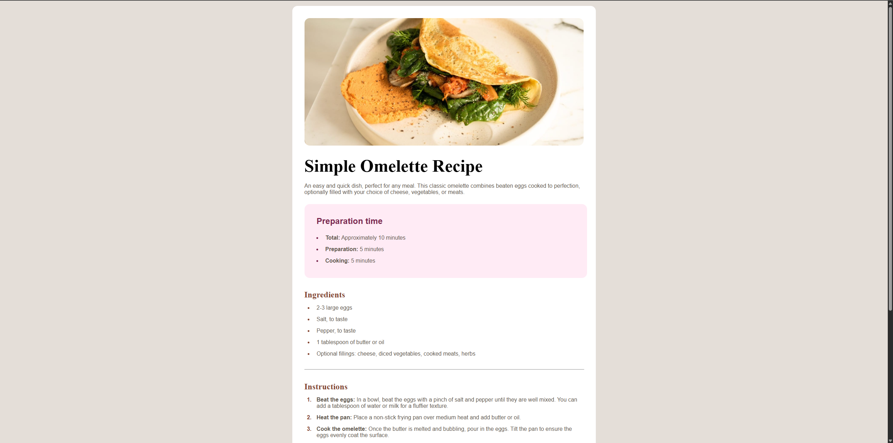

# Frontend Mentor - Recipe page solution

This is a solution to the [Recipe page challenge on Frontend Mentor](https://www.frontendmentor.io/challenges/recipe-page-KiTsR8QQKm). Frontend Mentor challenges help you improve your coding skills by building realistic projects. 

### Screenshot

### Links

- Solution URL: [Solution](https://github.com/beregszaszi-levente/FM-RecipePage)
- Live Site URL: [Live Site](https://your-live-site-url.com)

## Author

- Frontend Mentor - [@beregszaszi-levente](https://www.frontendmentor.io/profile/beregszaszi-levente)
